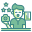

<!-- PROJECT LOGO -->
 

  

  <h3 align="center">YoungMinds</h3>

  

    The Youth Consultation website is an online platform that provides support, information and resources to youth in dealing with their life problems. With articles, guides, online counseling, and inspirational stories, this website aims to improve youth's mental well-being, facilitate problem solving, and provide quick access to relevant resources.
     
    <a href="https://docs.google.com/document/d/1VZlZm6ylXzXYl9dQnZL7W3UpeZ2NqiEywgOiwRdFvb0/edit?usp=sharing">           <strong>Explore the docs »</strong></a>
     
     
    <a href="https://github.com/github_username/repo_name](https://github.com/nararyacodetechy/Capstone-Konsultasi-Remaja">View Demo</a> .
    <a href="https://github.com/nararyacodetechy/Capstone-Konsultasi-Remaja">Report Bug</a> .
    <a href="https://github.com/nararyacodetechy/Capstone-Konsultasi-Remaja">Request Feature</a>
  

<!-- TABLE OF CONTENTS -->

  
List of Contents

  <ol>
    <li>
      <a href="#about-the-project">About The Project</a>
      <ul>
        <li><a href="#built-with">Built With</a></li>
      </ul>
    </li>
    <li>
      <a href="#getting-started">Getting Started</a>
      <ul>
        <li><a href="#prerequisites">Prerequisites</a></li>
        <li><a href="#installation">Installation</a></li>
      </ul>
    </li>
    <li><a href="#usage">Usage</a></li>
    <li><a href="#roadmap">Roadmap</a></li>
    <li><a href="#contributor">Contributor</a></li>
    <li><a href="#license">License</a></li>
    <li><a href="#contact">Contact</a></li>
  </ol>

